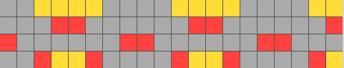
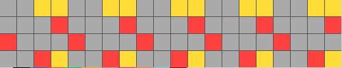
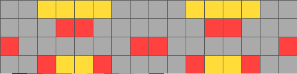

# The Abstraction and Reasoning Corpus (Multi Choice) (ARC-C) 干扰项标注说明

说明：我们标注的目标是 ARC 的**干扰项**。我们提供问题和答案，请同学们标注和答案思考方向相似，但是某些逻辑推理环节出错的干扰项。(相当于学生时代的易错题)

- 下载数据集

```
git clone git@github.com:ZhuFengdaaa/ARC-C.git
```

- 运行网页服务器

```
python2 server.py
```

- 访问标注网站

打开浏览器，访问 http://127.0.0.1:8080

- 登录

输入用户名(以自己名字命名)。服务器将会在 clone 下来的 ARC-C 主目录下生成名为 "label_<用户名>" 的文件夹。所有标注结果将保存在该文件夹下。

- 标注方法


如图所示为一个标注样例，系统将会从题库里随机抽取一道题。每道题有三个样本。如上图左边所示，每个样本 i 由一对图片(Q<sub>i</sub>, A<sub>i</sub>)组成。请找到适用于这三个样例的 (Q<sub>i</sub>,A<sub>i</sub>) 转化关系。在样例中，一个通用的 Qi => Ai 的转化关系是把 4x4 的图片水平复制5份，变成 4x20, 并且将第二、第四份水平翻转。标注样例的右上角是一道题目Q。请对题目 Q 应用我们从三个样本中的总结得到的转化关系得到答案。请将答案填写在右下角的输入框中。根绝我们总结的规律，我们得到的答案如下图所示: 



请认真思考并提交你认为**正确**的答案。如果错误，答案将会被保存成为干扰项。如果正确，那么请标注一个你觉得最有挑战性的干扰项。干扰项是由某个逻辑推理环节出错造成的。比如: 



这张图shape是对的，但是第二第四个方块没有翻转



这张图将第二、第四个方块翻转了，但是少了一个方块，大小对不上

点击蓝色 "save" 按钮保存。这里为了防止误点，设置了双保险。再点击红色 "save" 按钮确认即可。

- 提交标注样本

完成后将主目录下的"label_<用户名>" 的文件夹打包并收集汇总

```
tar -cf label_example label_example.tar
```

# FAQ

- 浏览/编辑已经提交的干扰项

在标注界面右边有个导航栏，里面是已经提交的所有干扰项。可以用鼠标点击，跳回原来那道题。重新submit后会**覆盖**之前的结果。

- 删除已经提交的干扰项

删除功能没做QAQ，太麻烦了。实在想删除可以去 label_<用户名> 里删除相应的json文件，刷新网页即可。

- 服务器崩溃/网页出错

terminal 里停掉 server 然后  `python2 server.py` 重启再刷新网页即可，所有数据都已及时保存。
